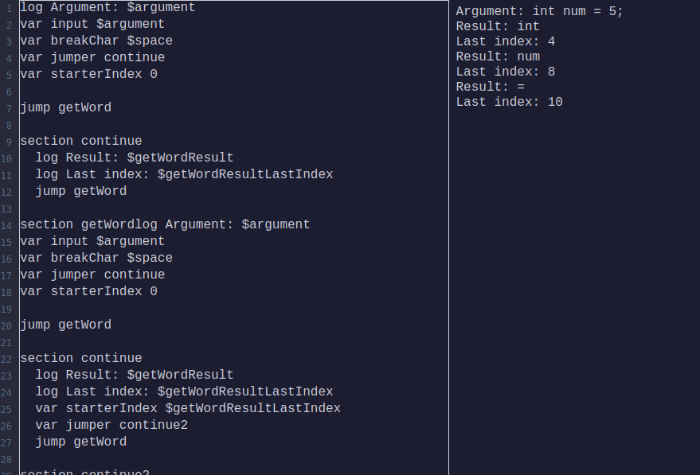

# Welcome to "bern-assembly"'s github page.

This little and fun project is about making the JavaScript into the "CPU" and simulating an "assembly-like" programming language inside the browser.  
The language itself is iterating through lines and running one command / line.

I've also made a very simplistic code editor for it, which you can find in the "demo" folder.

> Below, you can find pre-written programs. Just paste it into the editor and press "CTRL-S" to run.

I used the "live server" extension in VSCode to run the program, but I think you can use anything.

# Programs

In the "programs" folder, you can find some programs that I wrote in this simulated language that you can try.  
WARNING: There are programs that are unfinished.

## Finished:

- even-odd-guesser
- factorial
- fibonacci
- getWord
- "if" (universal if statement for future use :D think of it as a 'pre-coded' if statement)
- for-loop (same as the if)
- sumFirstInts

## Unfinished:

- arrays

## Future plans:

I've been planning to make a "C" type language in this assembly-like language, but it takes a little bit of time to think for a proper design of a compiler. (I have zero experience for compilers or anything like that; I just made this project based on my thoughts of how this would work.) And I even need to make universal things like arrays, objects, etc.
